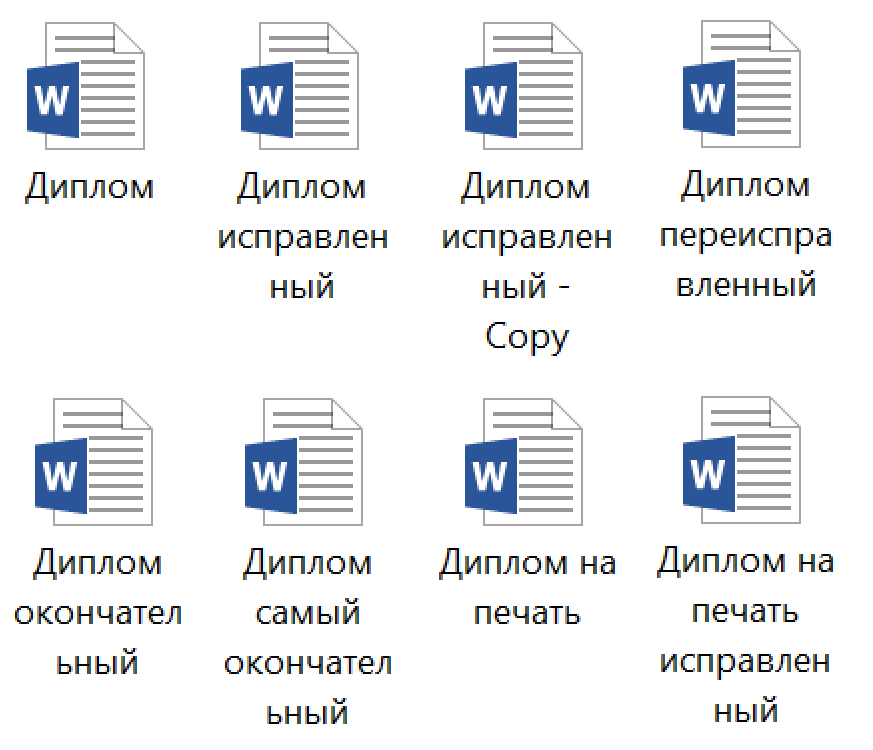

# Unit 1. Source Control
## Схема занятия
1. Команды git
2. Ветки
3. Упражнение на git branch/add/commit/push
4. Дебриф

---
# Что мы делаем с документами?
Когда мы работаем с обыкновенными документами в Google Docs или Word, что мы делаем?
* Создаем
* Редактируем
* Сохраняем

---
# Код — это тоже документ
Любой программист на самом деле с умным видом редактирует код в текстовом редакторе. Он их тоже создает, редактирует и сохраняет.
Только обычно программист редактирует несколько документов, и сохранять их нужно все вместе.

---
# Документы легко потерять
Когда документы хранятся локально на жестком диске вашего компьютера, их легко потерять:
* Ноутбук могут украсть
* Жесткий диск рано или поздно выйдет из строя
* На ноутбук можно пролить кофе или уронить
* Можно перезаписать документ по ошибке
* Сотрудник может уволиться

---
# Какое чувство вам знакомо?

---
# Удаленное хранилище
Чтобы решить проблему потери документов, их можно хранить в сети: на сетевом диске или в облаке (Google Drive, Яндекс Диск)

---
# Файловая помойка
Однако все мы сталкивались с ситуацией, когда сетевое хранилище превращается в помойку, в которой невозможно разобраться
* Несколько версий документа
* Непонятно какая последняя
* Редактировать могут все
* Удалять тоже

---
# Знакомая картина?

---
# История изменений
Удобно иметь историю изменений документа, чтобы вернуться к прошлой версии или посмотреть кто, когда и какие изменения вносил.

Примеры:
* Confluence
* Google Doc

---
# Ветки
Представьте, что вы выпустили первое издание книги и работаете над вторым. И вдруг в первом издании обнаружили опечатку. Как ее найти и исправить в обоих изданиях, если текст мог переехать в другой абзац или другую главу?
Для поддержки нескольких версий документов, которые можно исправлять независимо и переносить изменения между ними, придумали ветки.

---
## Поиск решения
Работа программиста — это постоянный поиск решения. В процессе работы нужно пробовать много разных идей, чтобы найти ту, которая решает поставленную задачу. При этом изменения вносятся в несколько файлов одновременно, например в код и тесты.
Поэтому были созданы инструменты, облегчающие работу с ветками, сохранение истории и откат изменений в нескольких файлах.

---
# Системы управления исходным кодом
Системы управления исходным кодом придуманы, чтобы избежать проблем, связанных с потерей информации. Самая распространенная система управления исходным кодом — git. На базе git создано несколько решений, бесплатных и коммерческих:
* GitHub — облачная система хранения исходного кода
* GitLab — on-premise система хранения исходного кода + экосистема CI/CD
* Bitbucket — облачная или on-premise система хранения исходного кода + CI/CD инструменты

---
# Локальный и удаленный репозиторий
**Удаленный репозиторий**
* Хранится на сервере или в облаке
* Виден всем участникам команды разработки
* Используется для интеграции

**Локальный репозиторий** 
* Хранится на локальном диске
* Виден только вам
---
# Интерфейс git
git понимает команды в терминале, но многие средства разработки (например VS Code) облегчают работу с git при помощи визуальных инструментов и меню.

---
# Основные команды git

---
# Контрольные вопросы
* Чем локальный репозиторий отличается от удаленного?
* Что такое коммит? На что он похож при работе с документом?
* Как посмотреть в какой ветке вы находитесь?
* Как создать ветку?
* Как переключить ветку?
* Чем pull отличается от push?

---
# Упражнение1. Напишите сказку про колобка в своей ветке

Так как код — это текст, для знакомства с git нам достаточно навыков работы с текстом. Мы будем вместе писать сказку про колобка.

Объединитесь в группы по 2-3 человека. Каждая группа будет работать в своей ветке. В результате мы получим несколько версий сказки от разных групп.

---
<!-- _class: invert -->
Упражнение 1. Напишите сказку про колобка в своей ветке

1. Склонируйте репозиторий
*git clone https://github.com/bevzuk/technical-excellence-101.git*  
 или возьмите последнюю версию
*git pull*
1. Создайте ветку, например **group1**
*git checkout -b group1*
1. Откройте файл **Unit1. Source Control/Kolobok.md**
1. Напишите сказку про колобка
1. Закомитьте файл
*git add .  
git commit -m "Описание изменений"*
1. Запушьте вашу ветку в репозиторий
*git push -u origin group1* (первый раз) или *git push (повторно)*

---
<!-- _class: invert -->
Упражнение 2. Переключитесь между ветками
1. Затяните последние изменения
    * *git pull*
1. Посмотрите список всех веток
    * *git branch -a*
1. Переключитесь в ветку master
    * *git checkout master*
1. Откройте сказку и убедитесь, что ваших изменений нет. Не паникуйте.
1. Переключитесь в любую другую ветку и посмотрите версии сказки других групп
    * *git checkout <другая ветка>*
1. Переключитесь обратно в вашу ветку
    * *git checkout <имя вашей ветки>*
1. Откройте сказку и убедитесь, что ваши изменения на месте. Выдохните.

---
# Материалы
* [tproger.ru: Введение в Git: от установки до основных команд](https://tproger.ru/translations/beginner-git-cheatsheet/)
* [hexlet: Бесплатный курс "Введение в Git"](https://ru.hexlet.io/courses/intro_to_git)
* [Книга Pro Git](https://git-scm.com/book/ru/v2)