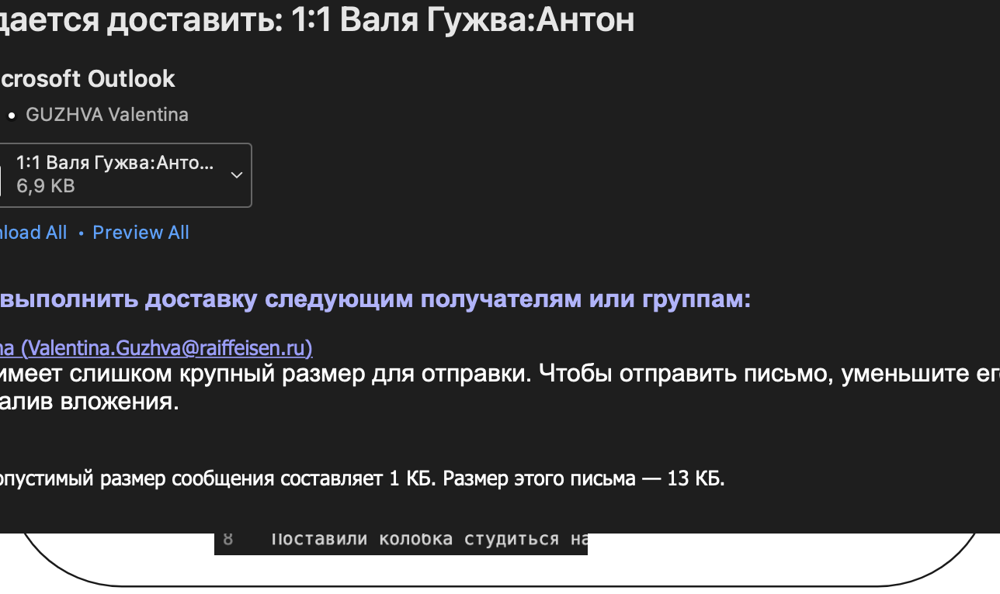
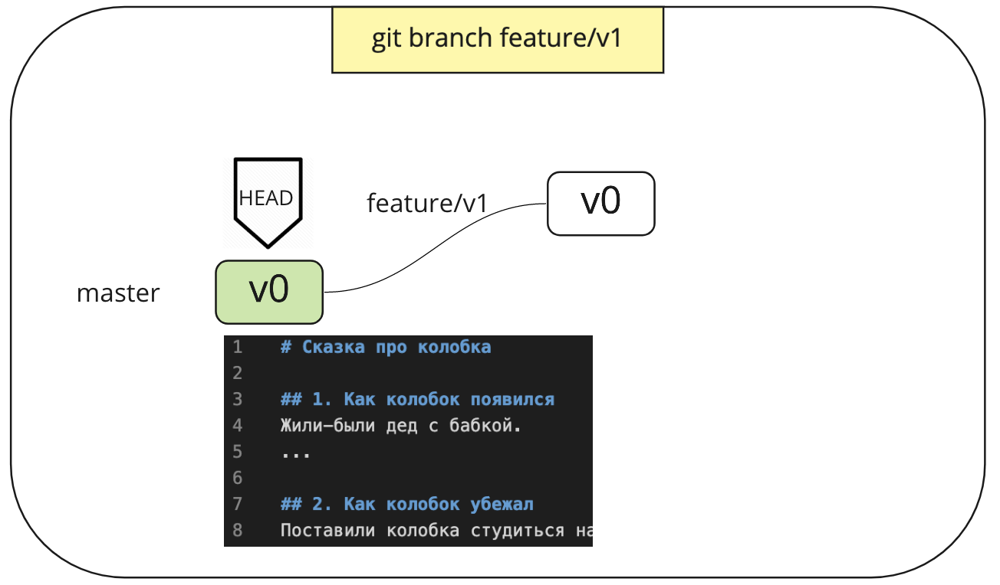
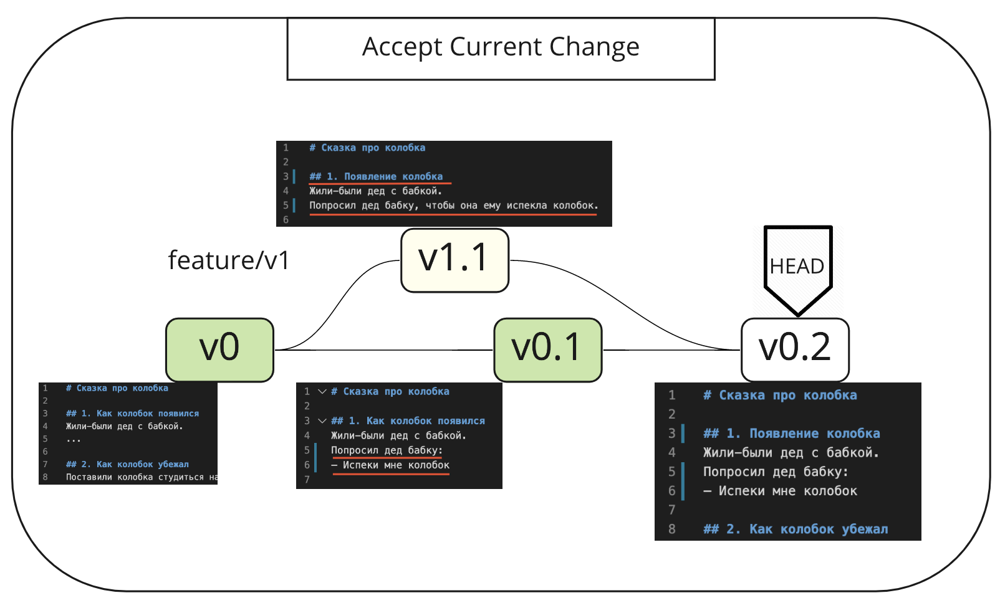
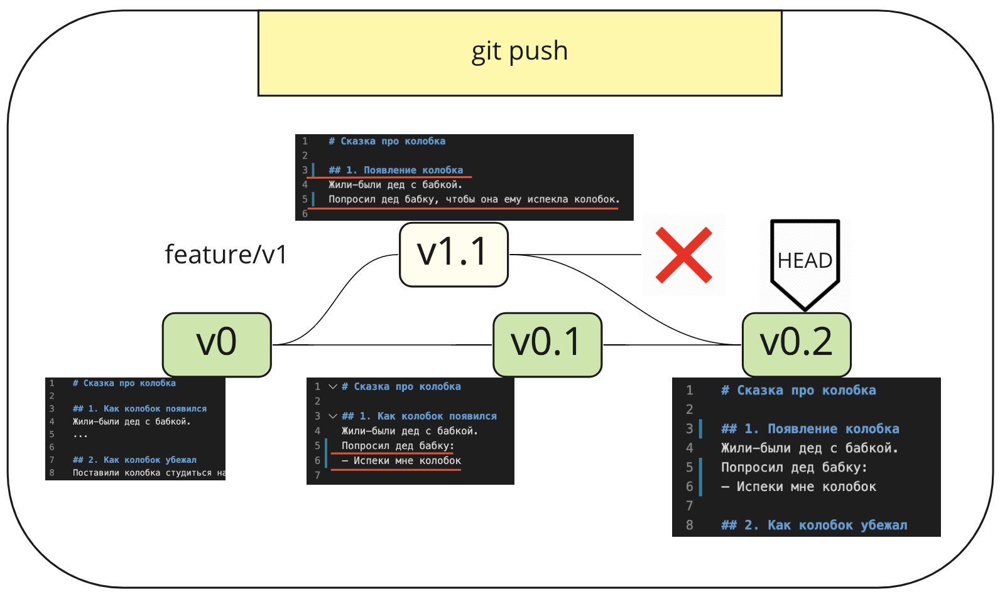

# Unit 2. Merge & Trunk Based Development
## Схема занятия
1. Merge
2. Упражнение на merge
3. Merge hell
4. TBD
5. Упражнение на TBD
6. Дебриф

---
# Merge

---
# 01. git pull
Мы взяли последнюю версию текста из ветки master и видим последние изменения в локальном репозитории.
HEAD — указатель на текущую версию локального репозитория.
HEAD указывает на версию v0, которая совпадает с master.

---
# 02. git branch
Команда *git branch* создает новую ветку **feature/v1**. HEAD пока не изменился, он по-прежнему смотрит на master. В редакторе мы видим версию файлов v0.

---
# 03. git checkout
Команда *git checkout* переключает HEAD на ветку **feature/v1** в локальном репозитории. Визуально в редакторе ничего не изменилось, так как ветки master и feature/v1 ничем не отличаются.

---
# 04. git add / git commit
Мы изменили заголовок первого абзаца и текст сказки.
Командами *git add .* и *git commit -m* сохранили изменения в локальном репозитории. Так как HEAD указывал на ветку feature/v1, изменения сохранились в этой ветке. 
Обозначим эту версию текста v1.1.

---
# 05. Изменение в master
Пока мы с вами работали в ветке feature/v1, кто-то другой изменил сказку в ветке master и запушил изменения. В первом абзаце была добавлена прямая речь. Обозначим эту версию v0.1.

---
# 06. git checkout master
Теперь наша задача — смержить, то есть объединить в одну общую версию оба изменения.
Переключаемся в ветку master командой *git checkout master*.
Обратите внимание, что мы не видим последних изменений в ветке master. Мы видим версию v0, потому что наш локальный репозиторий отстал от удаленного.

---
# 07. git pull
Чтобы получить последнюю версию ветки master, выполняем команду *git pull*.
Теперь HEAD указывает на версию v0.1 и нам видны последние изменения в master.

---
# 08. git merge feature/v1
Команда *git merge <имя ветки>* объединяет изменения. Она вливает изменения из указанной ветки (feature/v1) в текущую (master, так как мы ранее переключились в master).
Слияние заголовка абзаца прошло без конфликтов, потому что изменения были сделаны только в ветке feature/v1.
А вот текст абзаца менялся в обоих ветках.
Это конфликт, который нам нужно разрешить.

---
# 09. git merge feature/v1
3 варианта действий
1. **Accept current change**: оставить текущую версию в ветке master и потерять изменения в feature/v1
2. **Accept incoming change**: принять изменения из ветки feature/v1 и потерять изменения в master
3. **Accept both changes**: взять оба варианта и разобраться позже

---
# 10. Accept current changes
Предположим, что мы выбрали первый вариант - оставить текущую версию (master). Обратите внимание, что речь идет только про конфликтующие изменения в тексте абзаца. Заголовок абзаца успешно смержился из feature/v1, так как у него не было конфликта.
Таким образом, мы объединили лучшие изменения из обоих веток:
* заголовок из feature/v1
* текст из master

Новую объединенную версию обозначим v0.2.

---
# 11. git add / git commit 
Сохраняем получившуюся версию в локальном репозитории
* *git add .*
* *git commit -m "Merge feature/v1 -> master"*

---
# 12. Удаляем ветку feature/v1
Чтобы удалить локальную ветку feature/v1, выполняем команду:
* *git branch -d feature/v1*

Флаг -d указывает, что мы хотим удалить ветку feature/v1.

Если вы пушили feature/v1 в удаленный репозиторий, ее нужно удалить оттуда командой:
* *git push origin --delete feature/v1*

---
# 13. git push
Наконец мы можем запушить наши изменения в master
* *git push*

---
<!-- _class: invert -->
# Упражнение. Смержьте вашу ветку в master и разрешите конфликты.
1. *git pull --all* - затянуть последнюю всех веток
2. *git checkout master* - переключиться в master
3. *git branch*  - посмотреть список веток
4. *git merge <имя ветки>* - смержить ветку в master
5. Разрешите конфликты (если есть)
6. *git add .* - добавить изменения в снапшот
7. *git commit -m "Merge <имя ветки> -> master"* - закомитить снапшот локально
8. *git push* - отправить изменения в удаленный репозиторий
9. *git branch -d <имя ветки>* - удалить локальную ветку
10. *git push origin --delete <имя ветки>* - удалить ветку на сервере

---
# Дебриф
* Какие проблемы вы наблюдали?
* Как вы бы предложили решить эти проблемы?

---
# Trunk Based Development
TBD - практика, когда работа всех команд ведется в одной ветке trunk. Весь код всех разработчиков сливается вместе и проверяется на наличие дефектов как можно раньше, автоматически.
2 варианта
* Без веток
  * Как в Google Doc
  * Интеграция в master как можно чаще
* С ветками
  * Как в Confluence
  * Ветки живут не больше 1 дня

Даже не до конца готовые фичи выходят в прод, но закрываются feature toggle.

---
# Trunk Based Development

[Сайт TBD](https://trunkbaseddevelopment.com)

---
<!-- _class: invert -->
# Упражнение. Работаем по TBD.
* Объединитесь в группы по 2-3 человека
* Возьмите последнюю версию
  * *git pull*
* Выберите себе одну из историй
1. Поменять персонажа Колобок -> Шаурмок
2. Поменять порядок встреч на Медведь -> Волк -> Заяц -> Лиса
3. Между Волком и Медведем добавить Кабана
4. Изменить финал на счастливый
* В каждой группе выберите таймкипера, который будет напоминать комитить и пушить код в master каждую минуту

---
<!-- _class: invert -->
1. Перед началом работы заберите последнюю версию master
    * *git checkout master*
    * *git pull*
1. Пишем текст
1. Комитим изменения в локальный репозиторий
    * *git add .*
    * *git commit -m "message"*
    * *git push*
4. Если не получается запушить 
    * *git pull*
5. Если есть конфликты, то их разрешаем и добавляем результаты
    * *git add .*
    * *git commit -m "message"*
    * *git push*

---
# Дебриф
* Что в этот раз было по другому?
* В чем вы видите пользу TBD?
* В чем вы видите сложность применения TBD?

---
# Домашнее задание
Спросите у вашей команды:
* Какая у нас модель ветвления и почему?
* Как долго живут ветки?
* Как много времени команда тратит на разрешение merge конфликтов?

Посчитайте статистику и покажите команде

---
# Материалы
* [Version Control for Multiple Agile Teams - Henrik Kniberg](https://www.infoq.com/articles/agile-version-control/)
* [Trunk Based Development](https://trunkbaseddevelopment.com)