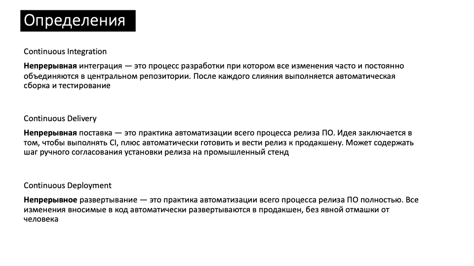

# Unit 5. CI/CD
## Схема занятия
1. Continuous Integration
2. Упражнение. Написать тест и исправить ошибку в HTML
3. CI Theatre
4. CI Dos / Dont's
5. Continuous Delivery
6. Continuous Deployment
7. Пример CD пайплайна
8. DORA метрики
9. Дебриф

---


---


---
# Тест. Есть ли CI в вашей команде?
1. **Каждый разработчик** команды **ежедневно** интегрирует **весь** код в master (1 балл)
2. После каждого изменения master запускается **автоматическая сборка** и тесты (1 балл)
3. Если билд падает, команда его чинит за **10 минут** (1 балл)

Если вы набрали 3 балла — поздравляем, у вас CI.

---
# Определение CI (Кент Бек)

Kent Beck, Extreme Programming Explained

---
# Определение CI (Мартин Фаулер)

[Martin Fowler - Continuous Integration](https://martinfowler.com/articles/continuousIntegration.html)

---
# Определение CI (LeSS)

[less.works - Continuous Integration](https://less.works/less/technical-excellence/continuous-integration.html)

---


---
# Описание ситуации
* Мы совместно пишем сказку про колобка в markdown
* Сказку будем публиковать на сайте, поэтому нужно преобразовать markdown -> HTML
  * Для этого будем использовать утилиту *markdown2*:
    ```markdown2 Kolobok.md >> ./build/Kolobok.html```
* Тесты проверяют корректность HTML файла 
  * Содержание
  * Форматирование

---
# Демо
 Что нужно сделать, чтобы проверить, что все работает правильно?
 1. ```rm -rf ./build``` удалить папку build со всем содержимым
 2. ```mkdir -p ./build``` пересоздать папку build
 3. ```markdown2 Kolobok.md > ./build/Kolobok.html``` сгенерировать HTML
 4. ```cat ./build/Kolobok.html``` вывести на экран содержимое HTML файла
 5. ```pytest``` запустить тесты

и нигде не ошибиться!

---
# CI билд
Помогает автоматизировать рутинные проверки


---
<!-- _class: invert -->
# Упражнение. Найти ошибку в HTML, написать тест и исправить
1. Возьмите последнюю версию ветки master
   ```git checkout master```
   ```git pull```
2. Создайте свою ветку
   ```git checkout -b feature/group1```
3. Откройте файл *Unit 5. CICD/Kolobok.md*
4. Найдите ошибку в файле

---
<!-- _class: invert -->
# Упражнение. Найти ошибку в HTML, написать тест и исправить

5. Добавьте тест для проверки ошибки в HTML файле, например
   ```python
   def test_has_subheader_wolf(html):
    assert '<h3>3.2 Волк</h3>' in html
   ```
6. Закомитьте и запушьте тест
   ```git add .```
   ```git commit -m "Добавил тест на подзаголовок с волком"```
   ```git push -u origin feature/group1```
7. Проверьте, что CI билд упал
   * Откройте [https://github.com/bevzuk/technical-excellence-101/actions](https://github.com/bevzuk/technical-excellence-101/actions)

---
<!-- _class: invert -->
# Упражнение. Найти ошибку в HTML, написать тест и исправить
8. Исправьте текст сказки
9. Запустите тесты локально, убедитесь что они зеленые
   ```make test```
10. Закомитьте и запушьте изменения в сказке
11. Убедитесь, что CI билд зеленый

---
<!-- _class: invert -->
# Упражнение. Найти ошибку в HTML, написать тест и исправить
12. Сделайте merge вашей ветки в master
    ```git checkout master```
    ```git pull```
    ```git merge feature/group1```
13. Исправьте конфликты (если есть)
14. Запушьте изменения в master
   ```git add .```
   ```git commit -m "Merge feature/group1 -> master"```
   ```git push```
15. Убедитесь, что CI билд зеленый

---
# Дебриф
* Как CI меняет поведение разработчиков?
* Почему важно, чтобы CI билд был быстрый?
* Почему важно, чтобы CI бидд был почти всегда зеленый?
* Что должна делать команда, если CI билд красный?
---
# Какие проблемы решает CI?


---


---


---


---


---


---


---
# Домашнее задание
1. Пройдите тест "Есть ли у нас CI?" с командой
2. Поисследуйте, есть ли в вашей команде признаки пародии на CI
3. Нарисуйте основные шаги CI билда вашей команды и сколько времени занимает каждый шаг
4. Обсудите с командой как сократить время билда до 10 минут
5. Посчитайте DORA метрики вашей команды
  